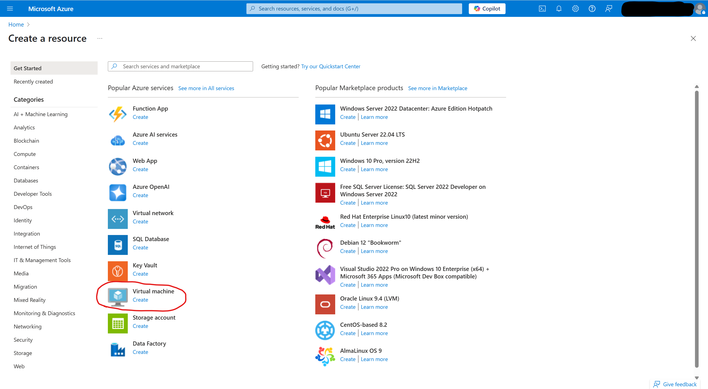
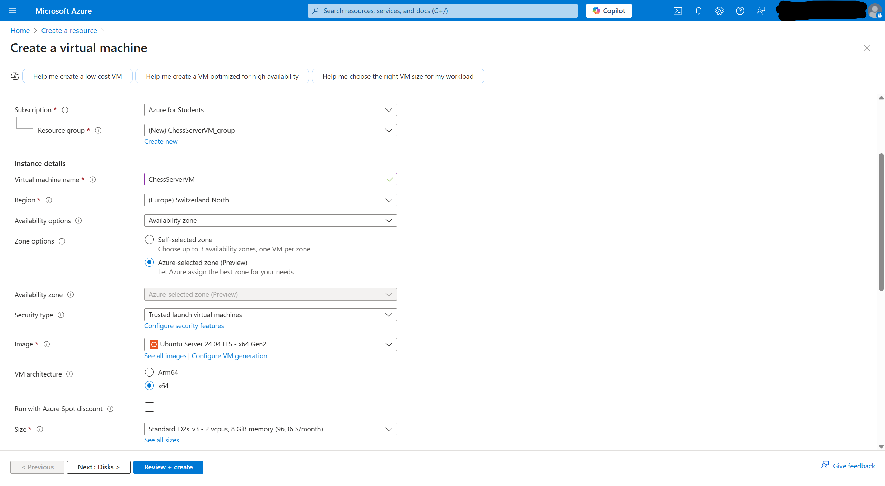
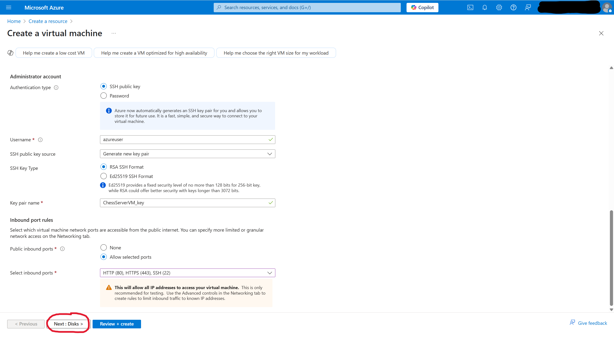
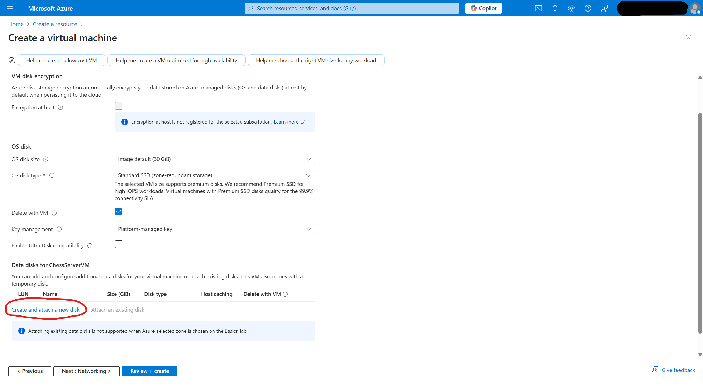
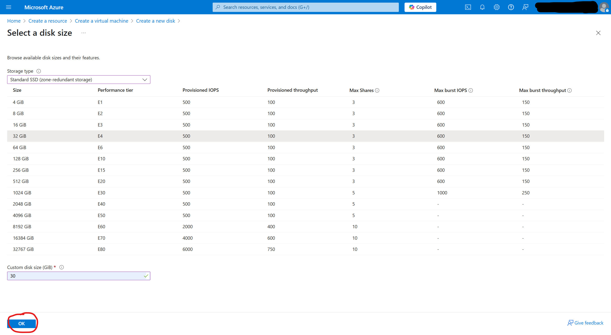
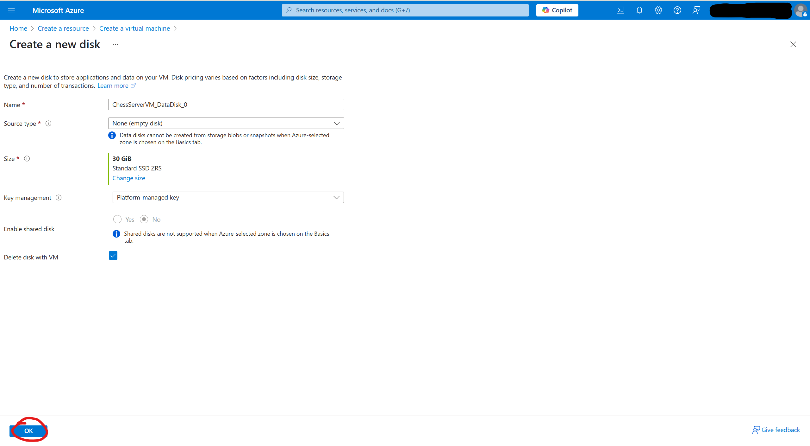
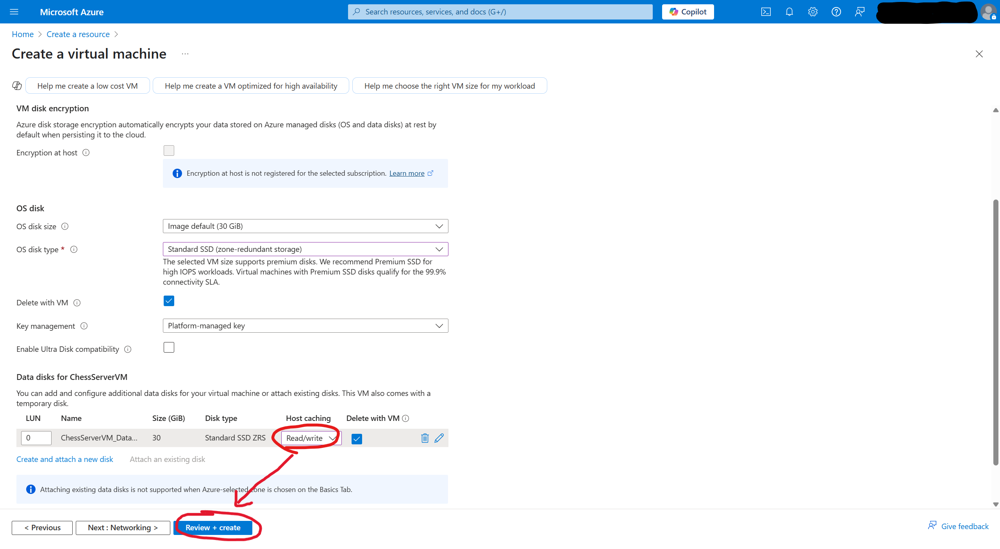

# Deployment Guide on Microsoft Azure

## Create virtual computer instance
A virtual computer instance has to be created on Microsoft's Azure Portal.

In this guide the Ubuntu Server 24.04 LTS is used for running the server and its web applications. The required architecture for the computer is 64-bit (not ARM-based) with Secure Boot and vTPM enabled. The VM-size D2s_v3 is used offering 8 GiB of RAM, 2 virtual CPUs and 30 GiB of Diskspace on an SSD. Disk encryption is disabled. It can execute up to 120 Input/Output operations per second (IOPS) on the drive. The HTTP and HTTPS-ports have to be enabled for input and output.

For setting the virtual computer up in the following steps the SSH-port 22 has to be enabled for input and output.

After finishing setting the virtual computer up, connect to the VM by using SSH in a terminal.

## Installation
The following dependencies have to be installed on the virtual computer to execute the applications and host the website:
- OpenJDK 21 (don't use JRE, unless the Java source code has already been compiled and you will transfer the binary code to the server)
- Nginx
- NodeJS
- NPM (use it to install the following packages: pm2)

When done you can start transferring the Java files for the chess AI to the Azure VM.

<b>In case you encounter issues referring to missing permissions to execute commands or modifying files, it's recommended to change the files' owner or execute commands as root, when accessing files outside of the user's home-directory. Beware when executing commands as root!</b>

## Starting the chess server

## SSL-certificate

## Finishing up
To avoid security leaks disable the SSH-port 22.

