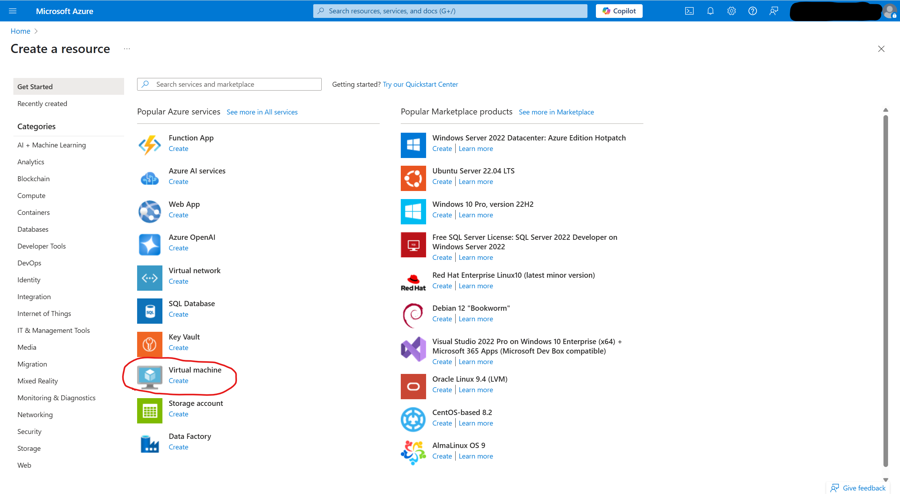
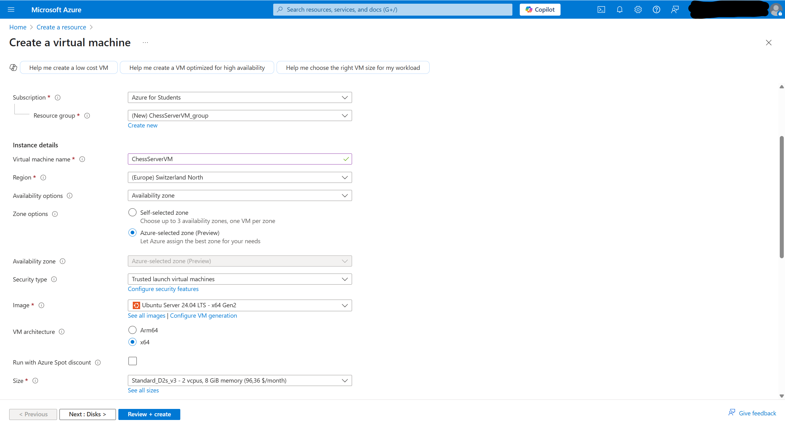
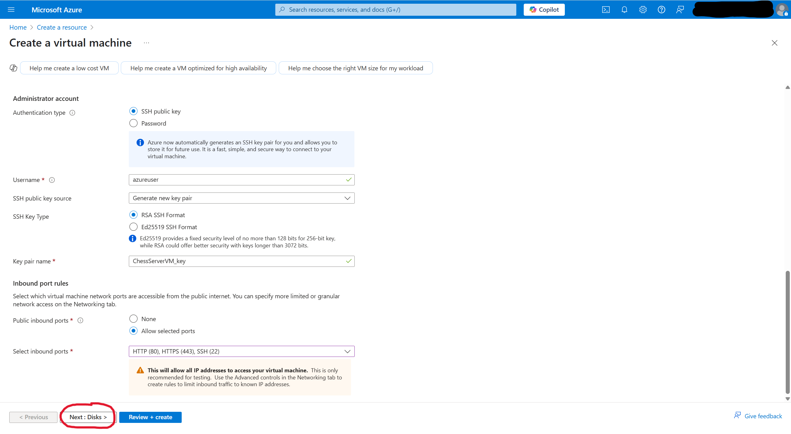
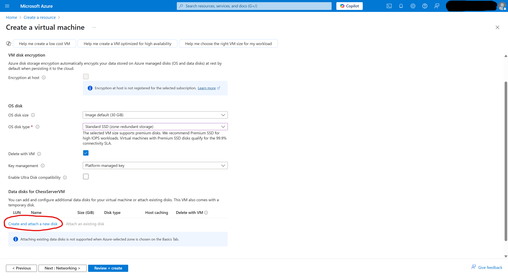
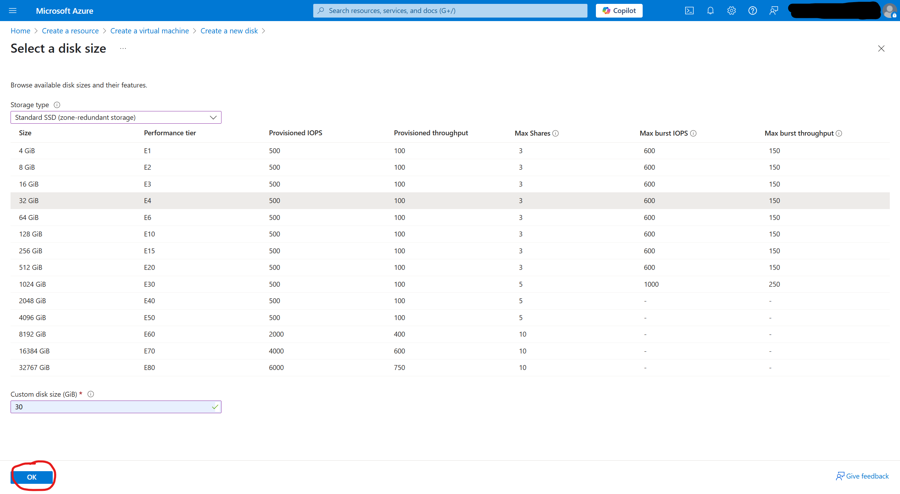
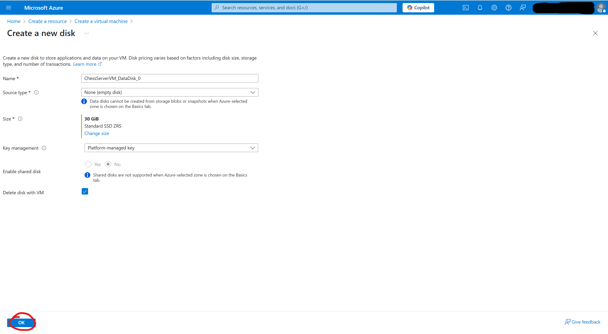
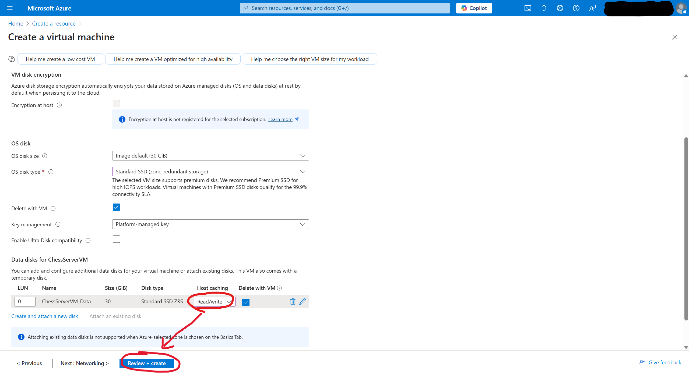

# Deployment Guide
This guide demonstrates installation of the chess server using a virtual machine on Microsoft Azure running Ubuntu, but the steps can be adapted to other cloud providers or local installations.

## Creating the virtual machine
On Microsoft's [Azure Portal](https://portal.azure.com), click on "Create a resource" and select "Virtual machine":


Then configure the VM according to the following steps:
<details>
  <summary>Basics</summary>



</details>

<details>
  <summary>Disks</summary>






</details>

After finishing setting the virtual computer up, connect to the VM by using SSH in a terminal: `ssh -i ChessServerVM_key.pem azureuser@<IP>`. You can find the IP address in the Azure portal under "Virtual machines" -> "Your VM" -> "Overview".


## Installing dependencies
```bash
sudo apt update && sudo apt upgrade
sudo apt install nginx
sudo apt install openjdk-21-jdk-headless
curl -o- https://raw.githubusercontent.com/nvm-sh/nvm/v0.40.3/install.sh | bash
```

Restart your shell session, then run:
```bash
nvm install 22
npm install pm2 -g
```


## Chess server setup
1. Transfer the files under [`server-fs`](./server-fs/) to their respective locations on the VM.
2. `git clone https://github.com/software-schreiber/chess`
4. `cd ./chess/chess-gui-nuxt/ && npm install && cd ~`
5. `cd start-scripts/`
   1. `chmod +x ./java-server.sh && chmod +x ./node-server.sh`
   2. `pm2 start ./java-server.sh`
   3. `pm2 start ./node-server.sh`
   4. `pm2 save`

