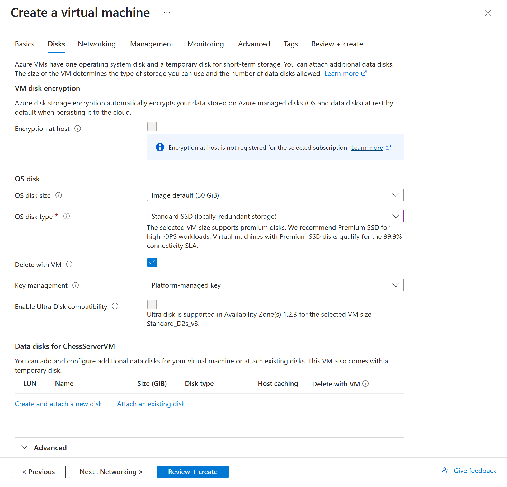

# Deployment Guide
This guide demonstrates installation of the chess server using a virtual machine on Microsoft Azure running Ubuntu, but the steps can be adapted to other cloud providers or local installations.

## Creating the virtual machine
On Microsoft's [Azure Portal](https://portal.azure.com), click on "Create a resource" and select "Virtual machine":


Then configure the VM according to the following steps:
<details>
  <summary>Basics</summary>


</details>

<details>
  <summary>Disks</summary>



"Create and attach a new disk":


"Change size":


"OK":

</details>

Then "Review + create". Follow the prompts to create the VM. After that's done, go to the VM's network settings and add an inbound port rule to allow destination port 3010, which is required for the websocket connection to the chess server.

After finishing setting the virtual computer up, connect to the VM by using SSH in a terminal: `ssh -i ChessServerVM_key.pem azureuser@<IP>`. You can find the IP address in the Azure portal under "Virtual machines" -> "Your VM" -> "Overview".


## Installing dependencies
```bash
sudo apt update && sudo apt upgrade
sudo apt install nginx
sudo apt install openjdk-21-jdk-headless
curl -o- https://raw.githubusercontent.com/nvm-sh/nvm/v0.40.3/install.sh | bash
```

Restart your shell session, then run:
```bash
nvm install 22
npm install pm2 -g

# Optional for SSL certificate obtaining:
sudo snap install lego
```


## Chess server setup
1. Transfer the files under [`server-fs`](./server-fs/) to their respective locations on the VM.
2. `git clone https://github.com/software-schreiber/chess`
4. `cd ./chess/chess-gui-nuxt/ && npm install && cd ~`
5. Copy your SSL certificate files to `/home/azureuser/certificates/` and adjust the file names in both the Nginx configuration and the Node server start scripts. If you don't yet have a certificate, we provide [a template script](./server-fs/home/azureuser/obtain-domain-cert.sh) that uses [`lego`](https://go-acme.github.io/lego/) to obtain a certificate for your domain.
6. The Java server requires the certificates in a specific format. Run [`copy-and-convert-certs.sh`](./server-fs/home/azureuser/copy-and-convert-cert.sh) to copy the lego-obtained certificates to the correct location and convert them to a Java keystore. Make sure to adjust this and the Java server start script to your certificate file names.
7. `cd ./start-scripts/`
   1. `chmod +x ./java-server.sh && chmod +x ./node-server.sh`
   2. `pm2 start ./java-server.sh`
   3. `pm2 start ./node-server.sh`
   4. `pm2 save`
8. When updates are available:
   1. `cd ~/chess/`
   2. `git pull`
   3. `cd ./chess-gui-nuxt/ && npm install`
   4. `pm2 restart node-server`
   5. `pm2 restart java-server`
9. For the production Node server, user the corresponding start script instead and run `cd ./chess-gui-nuxt/ && npm run build` once before first starting the server, or after updates.

For automatic pulling of updates from the Git repository, you can check out our work in progress [`newest-git`](./server-fs/home/azureuser/newest-git.sh) script.

